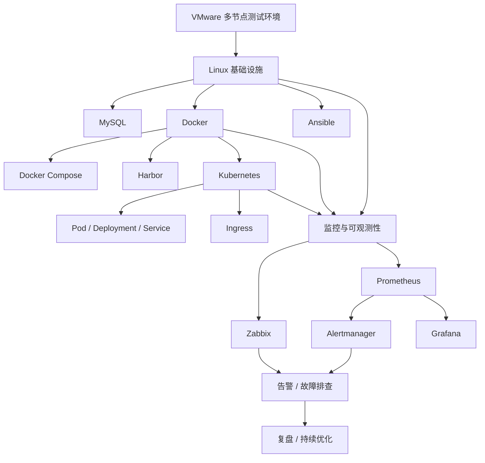

# devops-lab
DevOps practice projects, including backup scripts and automation tools, documenting the learning process of Linux operations.
# devops‑lab

## 中文

**中小规模业务运维与 DevOps 实践工程**

基于 **VMware 多节点测试集群**开展企业常见运维场景实践，覆盖 Linux 主机运维、MySQL 数据库、Ansible 自动化、Docker 容器化、Kubernetes 编排、监控告警、数据备份及故障排查等核心能力。

项目以 **标准化、自动化、可复现** 为核心目标，持续沉淀生产实践导向的部署配置、自动化运维脚本与故障复盘文档。

## English

**Small and Medium-scale Business Operations & DevOps Practice**

Built on a multi-node VMware test environment, this project simulates common enterprise operations scenarios, covering Linux administration, MySQL, Ansible automation, Docker containerization, Kubernetes orchestration, monitoring, backup, and troubleshooting.

The project focuses on **standardization, automation, and reproducibility**, with production-oriented configurations, automation scripts, and troubleshooting records continuously documented and refined.

---

## 技术栈 / Tech Stack

**Linux** · **MySQL 5.7 / 8.0** · **Ansible** · **Docker** · **Docker Compose** · **Kubernetes (K8s)** · **Harbor** · **Zabbix** · **Prometheus** · **Grafana** · **Alertmanager** · **Shell** · **Python** · **Alibaba Cloud**

---

## 核心实践 / Core Practices

**Linux 运维 / Linux Operations**
系统初始化、服务管理、网络、权限、日志分析与故障排查
System initialization, service management, networking, permissions, log analysis, and troubleshooting.

**MySQL 数据库 / MySQL Database**
多实例部署、权限管理、定时备份与数据恢复
Multi-instance deployment, access control, scheduled backup, and data recovery.

**Ansible 自动化 / Ansible Automation**
主机初始化、批量配置、Playbook 部署与幂等性实践
Host initialization, batch configuration, Playbook deployment, and idempotency.

**Docker 容器化 / Docker Containerization**
Dockerfile 构建、镜像管理、网络、Volume 与 Compose 编排
Dockerfile builds, image management, networking, volumes, and Compose orchestration.

**Kubernetes 编排 / Kubernetes Orchestration**
集群基础、Pod、Deployment、Service、ConfigMap 与 Ingress
Cluster fundamentals, Pods, Deployments, Services, ConfigMaps, and Ingress.

**Harbor 镜像仓库 / Harbor Registry**
私有镜像仓库、镜像推送与拉取、HTTPS 证书配置
Private registry deployment, image push/pull, and HTTPS configuration.

**监控与可观测性 / Monitoring & Observability**
Zabbix、Prometheus、PromQL、Alertmanager 与 Grafana
Infrastructure monitoring, metrics collection, alerting, and visualization.

**运维脚本 / Operations Scripts**
Shell / Python 实现自动备份、日志清理与系统巡检
Backup automation, log cleanup, and system inspection with Shell / Python.

**阿里云实践 / Alibaba Cloud Practice**
ECS、VPC、RDS、OSS、RAM 云资源部署与基础运维
Cloud resource deployment and administration with ECS, VPC, RDS, OSS, and RAM.

---

## 项目架构 / Project Architecture



---

## 当前仓库结构 / Current Repository Structure

> 仅展示已实际落地并完成实践的模块。
> 未完成模块将在实际实践完成后，再补充对应目录与代码。

> Only completed and maintained modules are listed below.
> New directories will be added after the corresponding practices are completed.

```text
devops-lab/
├── ansible/      # Ansible 自动化配置
├── docker/       # Docker / Compose 实践
├── mysql/        # MySQL 多实例与备份
├── scripts/      # Shell / Python 运维脚本
├── notes/        # 故障排查与复盘记录
└── README.md
```

---

## 运维闭环 / Operations Workflow

**环境建设 → 服务部署 → 自动化配置 → 容器化 → K8s 编排 → 监控告警 → 故障排查 → 复盘优化**

**Environment → Deployment → Automation → Containerization → K8s Orchestration → Monitoring → Troubleshooting → Continuous Improvement**

---

## 项目目标 / Project Goal

**中文：**
持续积累传统运维、自动化运维、容器化、Kubernetes、监控可观测及公有云运维能力，将实践经验沉淀为可复用的标准化运维资产。

**English:**
Build practical capabilities in traditional operations, automation, containerization, Kubernetes, observability, and public cloud operations, while turning hands-on experience into reusable and standardized operational assets.

---

## 声明 / Statement

所有实验均在个人测试环境完成。公开仓库不提交密码、密钥、证书、AccessKey 等敏感信息。

All experiments are conducted in private test environments. No passwords, keys, certificates, AccessKeys, or other sensitive information are committed to the public repository.

